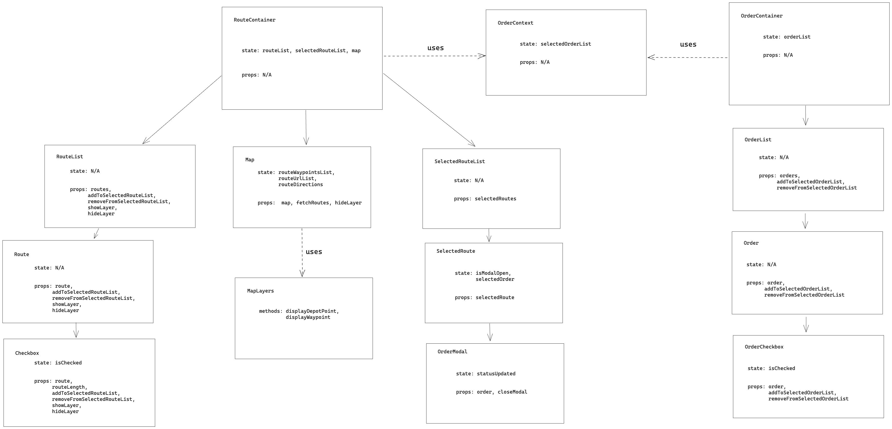
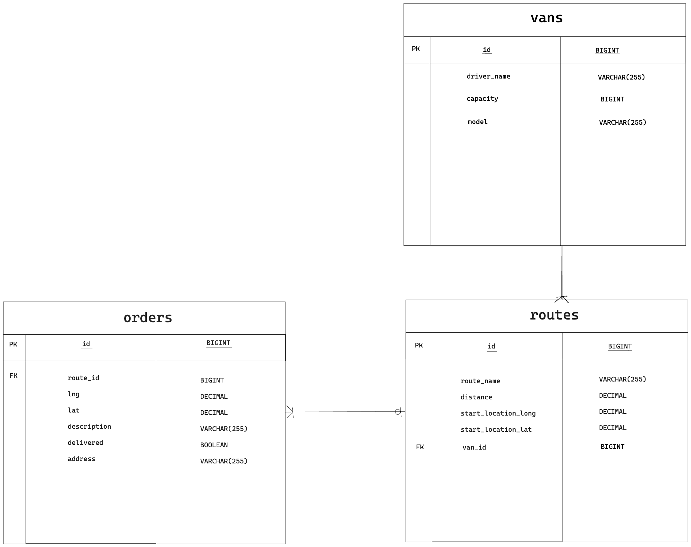
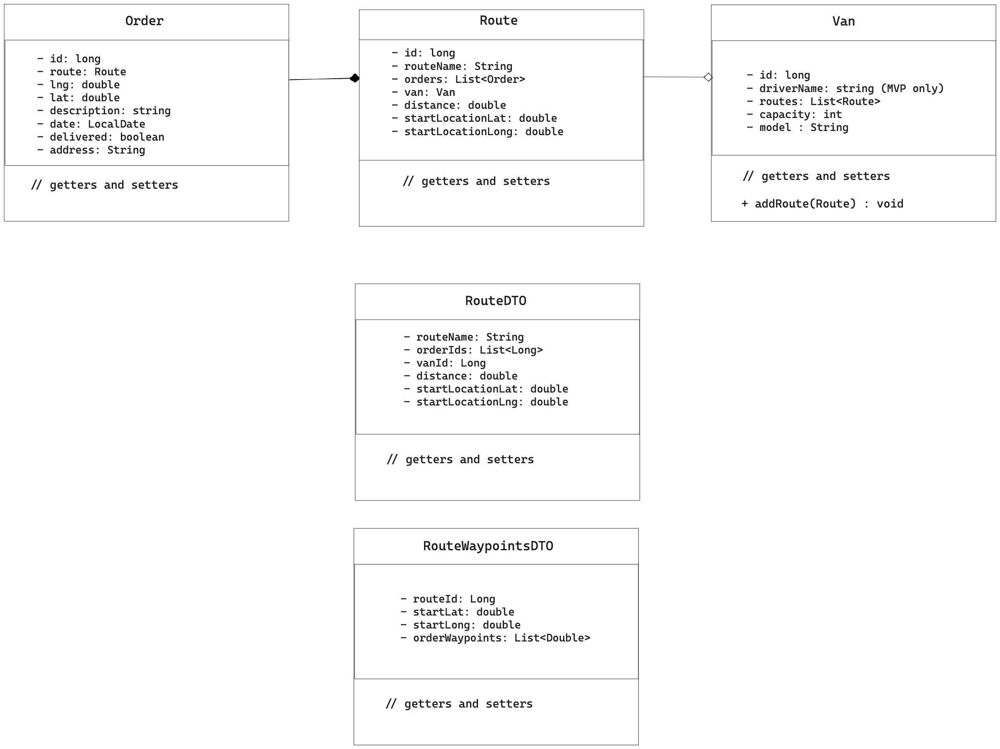
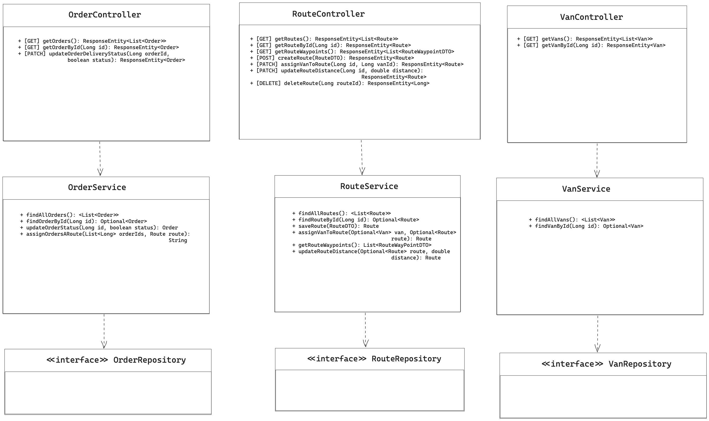

# Logistics Horizon - RouteFinder

## **Description**

This Capstone project aims aims to solve the business problem for a mock company called Rainforest Retail, which were having logistic issues of orders being manually sent to the warehouse and having vans that covered a specific route on a specific day regardless of the delivery amount. If there was no room in a van the delivery was delayed to the day after and there was also uneven distribution of orders allocated to the vans so that one truck might be empty and another may be full which meant those deliveries would have to wait untill the next time that van drove that route again. This resulted in a poor utlization of the delivery vehicles and deliveries being delayed during busy periods.

Our app planned to solve this by optimizing the usage of delivery vehicles to ensure that the vans would have adaptable routes based on the amount of orders. We would build a digital interface for the driver, so they could see what route they were assigned to and what orders are assigned to the route, as well as optimizing the delivery route to ensure the fastest delivery time and to optimize the orders assigned between all the vans so that they weren't half empty or overfilled so that they're being used effectively.

This app generates a route based on a number of orders with co-ordinates assiged to them and displays it on a map interface similar to google map, which a driver can use to navigate and deliver those packages.

## **Demo**

## **Diagrams and Documents**

### Business Case

[Business Case](../../../../Downloads/Capstone_Business_Case.pdf)

### Risk Register

[Risk Register](<../../../../Downloads/Capstone Risk Register - Simple Business Risk Register.pdf>)

### Frontend Diagrams

#### Wireframes

##### Main Page

##### Order Page

#### Component Diagram

### Backend Diagrams

#### Entity Relationship Diagram (ERD)

#### Class Diagram (UML)

##### Models

##### API Layers

## **Setup and Installation**

This project was done using Spring for the backend and React for the frontend. After cloning the backend repository a database should be created called logisitcs_db and you should run the program on IntelliJ IDEA. This will start the server code and you can use Postman to generate to look at the routes for the API.

After running the server on the backend you will need to clone the frontend repository and do an npm i to install the relevant dependencies, you can run the program using visual studio code and use npm run dev to start the server. You will need a mapbox API key in order for the routes to be generated, which is free to use for about 100,000 requests per month and it is reccomended you create an enviroment variable (.env file) outside the source folder and store the api key as:
VITE_APIKEY = 'your mapbox key'.

## **Tech Stack and Dependencies**

This is the tech stack what was used for this project. To run this project you will need to install IntelliJ IDEA, JDK 17, postgresSQL and visual studio code.

### Backend

- IntelliJ IDEA
- JDK 17
- Maven
- postgresSQL
- Spring Boot 3.1.4
- Spring Data JPA
- Spring Web
- PostgresSQL Driver
- Spring DevTools

### Frontend

- Visual Studio Code
- React 18.2.0
- React Modal
- React Router
- Mapbox API

## API Route Endpoints

| Controller | Mapping | Path                                           | Description                                                                                     | Output                                   |
| ---------- | ------- | ---------------------------------------------- | ----------------------------------------------------------------------------------------------- | ---------------------------------------- |
| Order      | GET     | localhost:8080/orders                          | show all orders                                                                                 | Returns a list of all orders             |
|            | GET     | localhost:8080/orders/{id}                     | index show order with id={id}                                                                   | Returns the order with id={id}           |
|            | PATCH   | localhost:8080/orders{id}/&status=STATUS       | sets order delivery status true or false                                                        | Sets order to delivered or not delivered |
| Route      | GET     | localhost:8080/routes                          | show all roots                                                                                  | returns a list of all routes             |
|            | GET     | localhost:8080/routes/{id}                     | index show route with id={id}                                                                   | returns the route with id={id}           |
|            | GET     | localhost:8080/routes/all/waypoints            | gets all waypoints from a route                                                                 |                                          |
|            | POST    | localhost:8080/routes                          | creates a route                                                                                 |                                          |
|            | PATCH   | localhost:8080/routes/{routeId}/assign/{vanId} | Assigns a specific route to a specific van via their id values                                  |                                          |
|            | PATCH   | localhost:8080/routes/{id}                     | Allows for routes distance to be updated by passing in routeId and then passing in the distance |                                          |
|            | DELETE  | localhost:8080/routes/{id}                     | Deletes route with Id ={id}                                                                     | \*\*                                     |
| Van        | GET     | localhost:8080/vans                            | show all vans                                                                                   |                                          |
|            | GET     | localhost:8080/vans/{id}                       | index show van with id={id}                                                                     |                                          |

## **_Colllaborators_**

- Callum [cbattenplowright](https://github.com/cbattenplowright)
-
